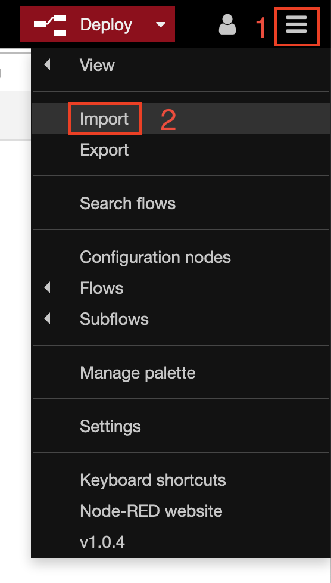
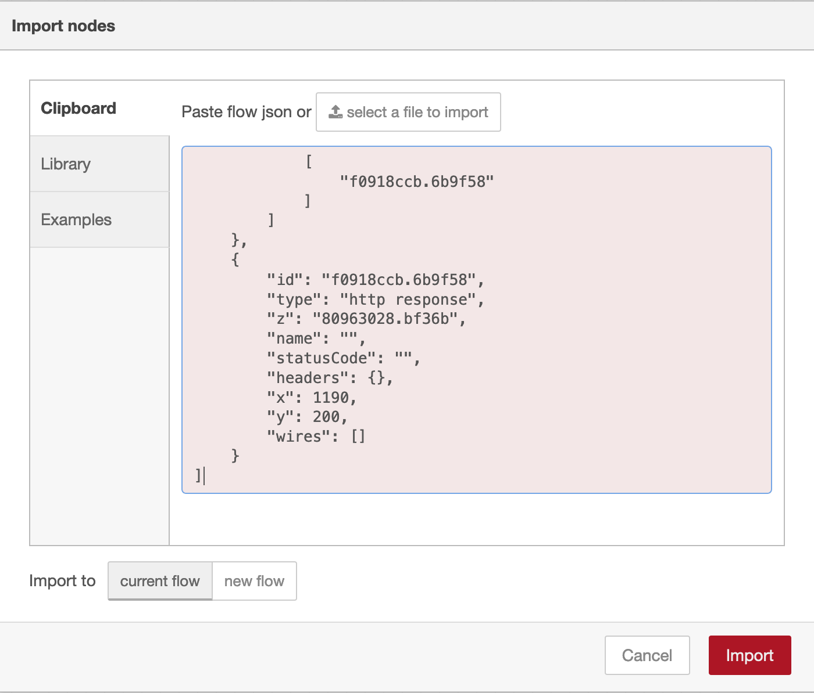

# Python version

## Requisitos minimos

- Conta na IBM Cloud

## Executando

Crie uma instância do Node-Red e acesse o dashboard da sua apicação.

1. No canto superior esquerdo do dashboard clique primeiro nas três listras, em seguida clique em `Import`

    

2. Faça o upload do arquivo flows.json, ou apenas copie e cole o conteúdo dele na janela que apareceu e clique em `Import`.

    

3. Recomendo que crie um [virtual environment](https://uoa-eresearch.github.io/eresearch-cookbook/recipe/2014/11/26/python-virtual-env/) para o projeto, mas isso é opcional, caso não queira realizar este passo pule para o próximo.

3. Instâncie os serviços e coloque as credenciais nos seu respectivos nós.

5. Clique em `Deploy` e teste sua aplicação.